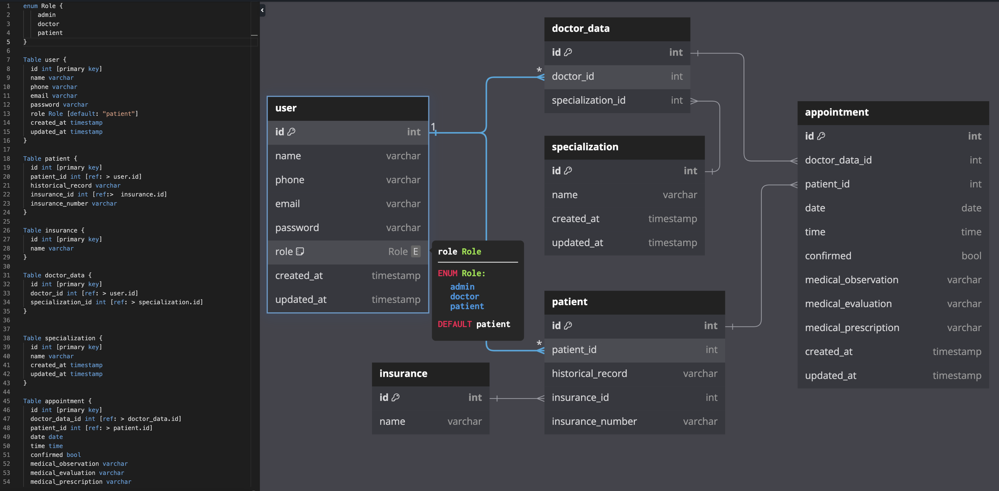

ALL ROUTES START WITH /api

### DB Diagram

### Authentication Endpoints

The Authentication flow for the application is:

### User Signup/Login

| METHOD | ENDPOINT     | TOKEN | ROLE | DESCRIPTION | POST PARAMS                  | RETURNS                                |
| ------ | ------------ | ----- | ---- | ----------- | ---------------------------- | -------------------------------------- |
| POST   | /auth/signup | -     | user | User Signup | `name`, `email`, `password`, | { message: `string`, result: `token` } |
| POST   | /auth/login  | -     | user | User Login  | `email`, `password`          | { message: `string`, result: `token` } |

### User Endpoints

| METHOD | ENDPOINT       | TOKEN | ROLE  | DESCRIPTION         | POST PARAMS                                  | RETURNS                                 |
| ------ | -------------- | ----- | ----- | ------------------- | -------------------------------------------- | --------------------------------------- |
| GET    | /user/profile  | YES   | user  | Get Own Profile     |                                              | { message: `string`, result: `object` } |
| PUT    | /user/profile  | YES   | user  | Update Own Profile  | `name`, `email`,`phone`                      | { message: `string`, result: `object` } |
| PUT    | /user/password | YES   | user  | Update Own password | `old password`, `new password`               | { message: `string`, result: `object` } |
| GET    | /user          | YES   | admin | Get All Users       |                                              | { message: `string`, result: `array` }  |
| GET    | /user/:id      | YES   | admin | Get One User        |                                              | { message: `string`, result: `object` } |
| PUT    | /user/:id      | YES   | admin | Update One User     | `name`, `email`, `phone`, `password`, `role` | { message: `string`, result: `object` } |
| POST   | /user          | YES   | admin | Create One User     | `name`, `email`, `phone`, `password`, `role` | { message: `string`, result: `object` } |

### Patient Endpoints

| METHOD | ENDPOINT | TOKEN | ROLE | DESCRIPTION             | POST PARAMS                                            | RETURNS                                 |
| ------ | -------- | ----- | ---- | ----------------------- | ------------------------------------------------------ | --------------------------------------- |
| GET    | /patient | YES   | user | Get Own patient data    |                                                        | { message: `string`, result: `object` } |
| PUT    | /patient | YES   | user | Update Own patient data | `historical_record`, `insurance_id`,`insurance_number` | { message: `string`, result: `object` } |

## Appoinments Endpoints

| METHOD | ENDPOINT         | TOKEN | ROLE   | DESCRIPTION              | POST PARAMS                                                                                                        | RETURNS                                 |
| ------ | ---------------- | ----- | ------ | ------------------------ | ------------------------------------------------------------------------------------------------------------------ | --------------------------------------- |
| GET    | /appointment     | YES   | user   | Get all own appointments |                                                                                                                    | { message: `string`, result: `array` }  |
| GET    | /appointment/:id | YES   | user   | Get one appointment      |                                                                                                                    | { message: `string`, result: `object` } |
| PUT    | /appointment/:id | YES   | user   | Update one appointment   | `doctor_data_id`, `date`, `time`, `confirmed`, `medical_observation`, `medical_evaluation`, `medical_prescription` | { message: `string`, result: `object` } |
| GET    | /appointment     | YES   | doctor | Get all own appointments |                                                                                                                    | { message: `string`, result: `array` }  |
| GET    | /appointment/:id | YES   | doctor | Get one appointment      |                                                                                                                    | { message: `string`, result: `object` } |
| PUT    | /appointment/:id | YES   | doctor | Update one appointment   | `confirmed`                                                                                                        | { message: `string`, result: `object` } |
| GET    | /appointment     | YES   | admin  | Get All appointments     |                                                                                                                    | { message: `string`, result: `array` }  |
| GET    | /appointment/:id | YES   | admin  | Get one appointment      |                                                                                                                    | { message: `string`, result: `object` } |
| PUT    | /appointment/:id | YES   | admin  | Update one appointment   | `doctor_data_id`, `date`, `time`, `confirmed`, `medical_observation`, `medical_evaluation`, `medical_prescription` | { message: `string`, result: `object` } |
| POST   | /appointment     | YES   | admin  | Create one appointment   | `doctor_data_id`, `date`, `time`, `confirmed`, `medical_observation`, `medical_evaluation`, `medical_prescription` | { message: `string`, result: `object` } |

## Doctor_data Endpoints

| METHOD | ENDPOINT         | TOKEN | ROLE   | DESCRIPTION            | POST PARAMS                 | RETURNS                                 |
| ------ | ---------------- | ----- | ------ | ---------------------- | --------------------------- | --------------------------------------- |
| GET    | /doctor_data     | YES   | doctor | Get All doctors data   |                             | { message: `string`, result: `array` }  |
| GET    | /doctor_data     | YES   | admin  | Get All doctors data   |                             | { message: `string`, result: `array` }  |
| GET    | /doctor_data/:id | YES   | admin  | Get One doctor data    |                             | { message: `string`, result: `object` } |
| PUT    | /doctor_data/:id | YES   | admin  | Update One doctor data | `doctor_id`, `specialty_id` | { message: `string`, result: `object` } |
| POST   | /doctor_data     | YES   | admin  | Create One doctor data | `doctor_id`, `specialty_id` | { message: `string`, result: `object` } |

## Specializations Endpoints

| METHOD | ENDPOINT            | TOKEN | ROLE  | DESCRIPTION               | POST PARAMS | RETURNS                                 |
| ------ | ------------------- | ----- | ----- | ------------------------- | ----------- | --------------------------------------- |
| GET    | /specialization     | YES   | admin | Get All Specializations   |             | { message: `string`, result: `array` }  |
| GET    | /specialization/:id | YES   | admin | Get One Specialization    |             | { message: `string`, result: `object` } |
| PUT    | /specialization/:id | YES   | admin | Update One Specialization | `name`      | { message: `string`, result: `object` } |
| POST   | /specialization     | YES   | admin | Create One Specialization | `name`      | { message: `string`, result: `object` } |

## Insurance Endpoints

| METHOD | ENDPOINT       | TOKEN | ROLE  | DESCRIPTION          | POST PARAMS | RETURNS                                 |
| ------ | -------------- | ----- | ----- | -------------------- | ----------- | --------------------------------------- |
| GET    | /insurance     | YES   | admin | Get All insurances   |             | { message: `string`, result: `array` }  |
| GET    | /insurance/:id | YES   | admin | Get One insurance    |             | { message: `string`, result: `object` } |
| PUT    | /insurance/:id | YES   | admin | Update One insurance | `name`      | { message: `string`, result: `object` } |
| POST   | /insurance     | YES   | admin | Create One insurance | `name`      | { message: `string`, result: `object` } |
